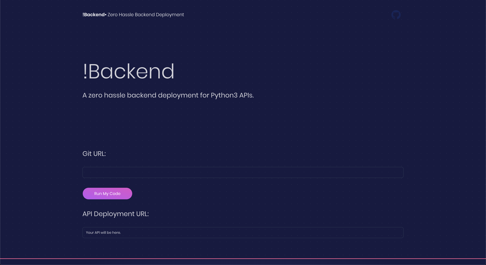
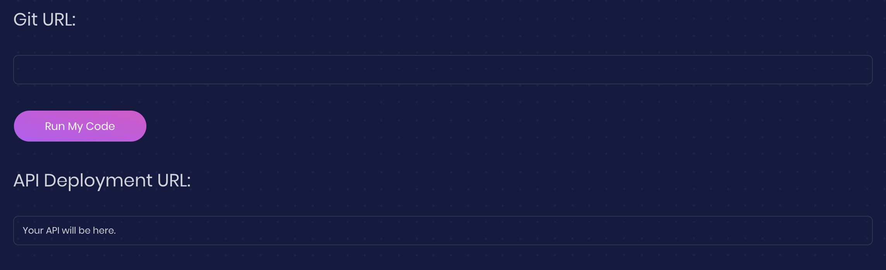
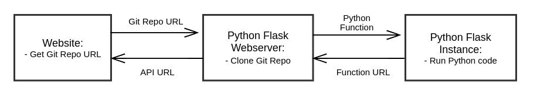

## Inspiration
Do you need an api? Are you tired of AWS and its complicated UI? A lot of the time, you just need an API link to run your Python code. With !Backend (not backend), this is possible.

## What it does
!Backend takes a URL to a public GitHub repository, sends it to run on a Python web server, and returns a link to execute the code.

## How it works
The service is built using Angular front-end web framework and Python Flask back-end framework. 
!Backend runs in the following steps:
  
  + Ask for URL input for GitHub public repository
  + Send URL to a Python web server
  + Web server starts a new instance for every function
  + Web server returns API URL

After the whole process, you should have a URL that runs your Python API.

## Challenges we ran into
+ Javascript
+ Typescript
+ Front end development

## Accomplishments that we're proud of
+ creating a well engineered and simple user experience
+ designing an inovative backend

## What's next for !Backend
+ The API generation is only possible under very specific conditions. The project could be built on to allow for larger projects with more specialized tools.
+ Security has to be handled very carefully whenever arbitrary code is being run on a server. Right now, security is not handled that way.

