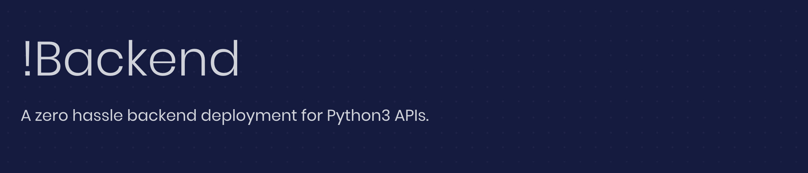

## Inspiration
Do you need an API? Are you tired of AWS and its complicated UI? API design tools can be confusing for beginners, so we set out to create the most simple backend deployment tool on the market - !Backend(pronounced not backend)

## What it does
!Backend takes a URL to a public GitHub repository, and gives you a link to run the functions as API requests.

## How it works
The service is built using Angular front-end web framework and Python Flask back-end framework. 
!Backend runs in the following steps:
  
  1. Ask for URL input for GitHub public repository
  2.  Send URL to a Python web server
  3. Backend server converts the `main.py` from the GitHub repo to a Python Flask application
  4. Web server returns API URL that can now call the functions of `main.py`

When a request is sent, if uses the UUID generated from step 4 to access the correct flask server, and runs the method with the parameters specified

After the whole process, you should have a URL that runs your Python API.

## Challenges we ran into
+ Javascript
+ Typescript
+ Front end development

## Accomplishments that we're proud of
+ creating a well engineered and simple user experience
+ designing an inovative backend

## What's next for !Backend
+ The API generation is only possible under very specific conditions. The project could be built on to allow for larger projects with more specialized tools.
+ Security has to be handled very carefully whenever arbitrary code is being run on a server. Right now, security is not handled that way.

